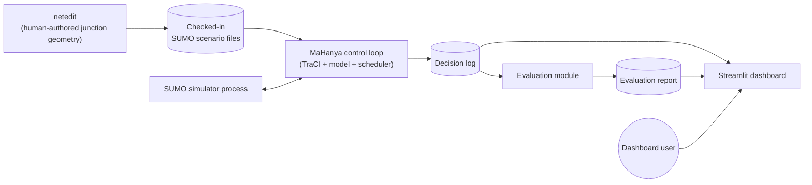
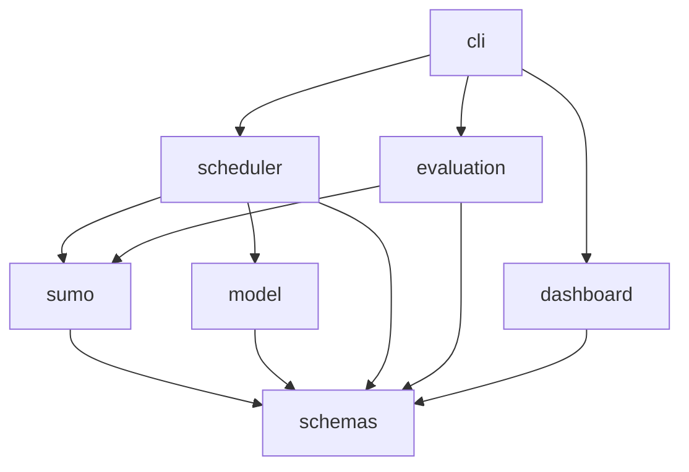

# MaHanya — Architecture

## Scope

This is the technical design reference: justified technology choices, component
boundaries, data contracts, and how the pieces fit together. It is not a
restatement of the [Product Spec](PRODUCT_SPEC.md) or [Product Flow](PRODUCT_FLOW.md)
— read those first for *what* and *why*; this document is *how*.

Nothing under `src/` exists yet. This document specifies a proposed source layout
and component design to build against once implementation starts.

## System context



`netedit` is an external GUI tool, not a Python dependency — junction geometry is
authored once, by hand, and the resulting `.net.xml`/`.rou.xml`/`.sumocfg` files
are checked in as data artifacts, not generated by application code.

## Tech stack

| Concern | Choice | Why |
|---|---|---|
| Language | Python 3.11 | Matches SUMO/TraCI's Python bindings and PyTorch; no reason to move off the version already pinned in `.python-version`. |
| Env / dependency manager | **uv** | Standing project convention: `uv` for any Python toolchain, `volta` for any JS/TS toolchain (this project currently has none — see [Dependency management](#dependency-management)). |
| Raw data storage | CSV for field counts; Parquet for generated training sequences | Field counts are small and need to be human-auditable; generated sequences are large and columnar, where Parquet is the efficient, standard choice. |
| Distribution fitting | `scipy.stats` (Poisson, negative binomial) with chi-square/KS goodness-of-fit | Poisson is the standard first choice for independent, low-to-moderate-volume arrivals; negative binomial is the documented fallback when arrivals are over-dispersed. Both are directly supported by `scipy.stats`. |
| Microsimulation | SUMO + TraCI (`traci`, `sumolib`) | Directly mandated by the project synopsis; SUMO is the de facto open-source standard for microscopic traffic simulation with a mature Python control API. |
| Junction geometry authoring | `netedit` | SUMO's own GUI network editor; not a library dependency, a separate authoring tool whose output is checked in as data. |
| Schemas / config | pydantic v2 + `pydantic-settings` | Continues the pattern from the retired `aitrafix` prototype's `types.py`, which already modeled per-direction traffic state cleanly. |
| Model | PyTorch, a small custom `nn.TransformerEncoder` | The synopsis specifically calls for a "lightweight Transformer Encoder" — a small number of layers/heads (roughly 2–4 layers, 2–4 heads, small `d_model`) over an engineered per-timestep feature vector, following the pattern in recent lightweight transformer-based signal-control literature. This explicitly replaces the retired prototype's `RandomForestClassifier` placeholder. |
| Scheduler | Plain deterministic Python (no FSM library) | The rule set (min/max green, transitions, anti-starvation, pre-emption) covers a small, fixed number of states and rules for a single junction. Plain, exhaustively-unit-testable code is more transparent and auditable here than introducing a general FSM library (e.g. `transitions`) for marginal benefit. |
| Evaluation | A custom metrics module (waiting time, queue length, throughput, priority response time) | These are standard traffic-engineering metrics with no off-the-shelf library that meaningfully saves effort here; computing them from logged TraCI state is straightforward. |
| Dashboard | Streamlit | Matches the project synopsis's own methodology; pure Python, fast to build, avoids introducing a second (JS) toolchain. See [Dashboard](#dashboard) below for the data-source implication. |
| Testing | `pytest` | Standard; scheduler rules are pure functions and the highest-value unit-test target. |
| Lint / type-check | `ruff`, `mypy --strict` + `pydantic.mypy` plugin | Continues the configuration already present in the retired prototype's `pyproject.toml`. |

### Dependency management

Python dependencies and the virtual environment are managed with **uv**
(`uv sync`, `uv run`, a committed `uv.lock`). The retired prototype used PDM with
a `[[tool.pdm.source]]` entry to pull a CPU-only PyTorch wheel index; the `uv`
equivalent is a `[[tool.uv.index]]` entry (naming the PyTorch CPU wheel index)
combined with a `[tool.uv.sources]` entry pinning `torch` to it. This is a
mechanical migration to make once `pyproject.toml` is reintroduced in the
implementation phase.

This project has no JS/TS toolchain and doesn't need one — the dashboard is pure
Python (Streamlit). If a JS/TS toolchain is ever introduced, `volta` is the
standing convention for managing it; there's nothing to configure for it today.

## Component breakdown

Each of the following is a proposed module under `src/mahanya/` (see
[Proposed source layout](#proposed-source-layout)).

- **`schemas`** — shared data contracts (see [Data contracts](#data-contracts)
  below). No other module's dependency; every other module depends on this one.
- **`data`** — ingests raw field-count CSVs, fits statistical distributions,
  and turns SUMO run logs into labelled training sequences (Parquet). Offline,
  batch-oriented.
- **`sumo`** — a thin TraCI client (connect, step, read state, set phase) and a
  translator from raw SUMO state into the `schemas` traffic-state contract.
  Owns all direct TraCI/SUMO interaction so nothing else needs to know TraCI's
  API shape.
- **`model`** — feature engineering, the transformer encoder definition,
  training loop, and inference. Depends only on `schemas`.
- **`scheduler`** — the deterministic rule engine (min/max green, transitions,
  anti-starvation, pre-emption) and the orchestration of one control-loop tick
  (observe → predict → validate → apply → log). Depends only on `schemas`, and
  calls into `sumo` and `model` through their public interfaces rather than
  reaching into their internals.
- **`evaluation`** — a fixed-time baseline controller plus the metrics module
  (waiting time, queue length, throughput, priority response time), run against
  logged data from both controllers.
- **`dashboard`** — the Streamlit app, reading from the logged decision store.
- **`cli`** — a single entrypoint exposing the pipeline stages (fit
  distribution, calibrate, generate sequences, train, run, evaluate, dashboard)
  as subcommands, replacing the retired prototype's ad hoc `demo/main.py`
  train/sim split.

### Module dependency direction



`schemas` is the shared kernel; `sumo`, `model`, and `evaluation` each depend on
it but not on each other. `scheduler` is the only module allowed to depend on
both `sumo` and `model`, since orchestrating a control-loop tick is its job.
This deliberately avoids the retired prototype's tight coupling, where
`helpers.py` (the SUMO driver) imported `traffic/__init__.py` (the controller)
directly, making the two impossible to test or evolve independently.

## Data contracts

The retired `aitrafix` prototype had a clean starting shape worth keeping and
extending, not discarding:

```python
# old: src/aitrafix/types.py
class TrafficDirection(Generic[T], BaseModel):
    north: T
    south: T
    east: T
    west: T

class TrafficModel(BaseModel):
    timestamp: str
    vehicles: TrafficDirection[int]
    emergency: TrafficDirection[int]
    light: TrafficDirection[Literal["red", "yellow", "green"]]
```

Proposed evolution for `src/mahanya/schemas/traffic.py`:

- **`TrafficDirection[T]`** — kept as-is; it's a useful generic primitive for any
  per-direction value.
- **`TrafficState`** (extends the old `TrafficModel`) — adds queue length and
  waiting time per direction, current phase, and elapsed phase time, since the
  model needs richer signal than raw counts alone.
- **`PhaseRecommendation`** (new) — the model's output: a recommended phase id
  plus a confidence/logit distribution over phases. Didn't exist in the old
  prototype, which conflated "model output" and "applied state."
- **`SchedulerDecision`** (new) — the final applied phase, whether it matched
  the model's recommendation, and a reason code (`model_accepted`,
  `min_green_hold`, `anti_starvation_force`, `emergency_preempt`, ...). This is
  what makes every override auditable, per the [Product Spec](PRODUCT_SPEC.md#non-functional-requirements)
  requirement.

**Open assumption, flagged for revisit:** the retired prototype enumerated a
fixed 9-state phase space (one direction green, or its yellow, or all-red) for a
simple single-ring 4-leg junction. This is kept as the default assumption for
MaHanya's phase space unless the actual Sapon Under-bridge Junction geometry —
once surveyed — requires protected-turn phases (e.g. simultaneous
non-conflicting greens), which would expand both `PhaseRecommendation`'s output
space and the SUMO network's phase definitions. This should be confirmed once
the real junction layout is available, not assumed permanently.

## Config strategy

A single `pydantic-settings`-based `Config` object, layered: in-code defaults →
an optional `config.yaml`/`.env` → CLI overrides. One config surface covers
simulation parameters (SUMO scenario paths, control interval), model
hyperparameters (sequence length, model dimensions), scheduler thresholds
(minimum/maximum green seconds, anti-starvation threshold, transition interval
lengths), and dashboard refresh interval — avoiding the retired prototype's
pattern of scattering magic numbers (e.g. hardcoded phase maps, a hardcoded
traffic-light id) across multiple classes.

## Testing strategy

- **Unit tests** for `scheduler` rules — pure functions, no I/O, the highest
  priority target since this is the safety-critical layer. Should exhaustively
  cover minimum/maximum green edge cases, transition sequencing, anti-starvation
  triggering, and pre-emption interrupting/resuming normal control.
- **Contract/shape tests** for `model` — verify input/output shapes and that
  inference never raises on well-formed input; explicitly not accuracy
  assertions (accuracy is an evaluation concern, not a unit-test concern).
- **One headless integration test** running a short scenario via `sumo` (not
  `sumo-gui`) end-to-end through the control loop, to catch integration
  regressions between `sumo`, `scheduler`, and `schemas`.
- Fixtures for synthetic `TrafficState` sequences live under `tests/fixtures/`,
  so scheduler and model tests don't depend on a running SUMO instance.

## Observability / logging

Every control-loop tick appends one JSON-lines record to the decision log:
observed `TrafficState`, the model's `PhaseRecommendation` (if the tick wasn't a
pre-emption short-circuit), the resulting `SchedulerDecision` with its reason
code, and a timestamp. This is a per-line evolution of the retired prototype's
pattern of dumping one big JSON blob of `state_history` at the end of a run —
per-line records are what let the dashboard poll incrementally instead of
waiting for a run to finish.

## Dashboard

Streamlit, reading from the logged decision store (JSON-lines or SQLite) rather
than attaching to the control loop in-process. This follows directly from
Streamlit's execution model — a Streamlit script reruns top-to-bottom on each
refresh/interaction, which doesn't suit holding a live reference into another
process's loop state. The control loop is the writer; the dashboard is a
polling reader. See [Product Flow](PRODUCT_FLOW.md#dashboard-data-source) for
the operational view of this.

## Execution model

This is simulation-only — there is no "deployment" in a production sense, only
"how to run a scenario locally." A single scenario run involves: the SUMO
process (started via TraCI), the control loop (driving it), and optionally the
Streamlit dashboard (reading its logged output) — orchestrated through the
`cli` module's subcommands rather than as separately deployed services.

## Proposed source layout

Not created yet — documented here as the target for the implementation phase.

```
src/mahanya/
├── __init__.py
├── config.py                  # pydantic-settings Config: paths, sim params, hyperparams, thresholds
├── schemas/
│   ├── __init__.py
│   └── traffic.py              # TrafficDirection[T], TrafficState, PhaseRecommendation, SchedulerDecision
├── data/
│   ├── ingest.py                # load raw field-count CSVs
│   ├── distribution_fit.py      # scipy.stats fitting (Poisson/NB) + goodness-of-fit
│   └── sequence_gen.py          # SUMO run logs -> labelled training sequences (Parquet)
├── sumo/
│   ├── network/                 # netedit-authored .net.xml/.rou.xml/.sumocfg (data, not code)
│   ├── traci_client.py          # thin TraCI wrapper: connect/step/get-state/set-phase
│   └── state_extractor.py       # SUMO state -> TrafficState
├── model/
│   ├── features.py              # per-timestep feature engineering
│   ├── transformer.py           # lightweight nn.TransformerEncoder definition
│   ├── train.py                 # training loop, checkpointing
│   └── infer.py                 # load model, produce PhaseRecommendation
├── scheduler/
│   ├── rules.py                 # min/max green, transitions, anti-starvation, pre-emption
│   └── controller.py            # one control-loop tick: observe -> predict -> validate -> apply -> log
├── evaluation/
│   ├── baseline.py               # fixed-time baseline controller
│   └── metrics.py                # waiting time, queue length, throughput, priority response time
├── dashboard/
│   └── app.py                    # Streamlit entrypoint
└── cli.py                        # unified CLI: fit, calibrate, generate, train, run, evaluate, dashboard
tests/
├── unit/
├── integration/
└── fixtures/
data/                              # gitignored: raw + processed datasets
models/                            # gitignored: trained model artifacts
```

## Migration notes from aitrafix

**Kept (as inspiration, not verbatim code — the old code is deleted):**
- The `TrafficDirection[T]` / `TrafficModel` pydantic shape, extended into
  `TrafficState`.
- The general pattern of a thin TraCI wrapper translating SUMO state into a
  typed schema.
- Per-tick JSON logging, evolved from one big end-of-run blob into
  per-line JSON-lines records.

**Discarded:**
- The `RandomForestClassifier` placeholder — the synopsis calls for a
  transformer encoder, not a random forest.
- The duplicated `TrafficController` / `VehicleCounter` classes (near-identical
  code with no clear reason for the split).
- The fixed 9-state enumeration treated as the *only possible* phase space
  (kept as a documented default assumption instead, see
  [Data contracts](#data-contracts)).
- The `"manual"` `input()`-driven control mode in `SUMOTrafficSimulation.run` —
  useful for early prototyping, not part of the evaluated system.
- PDM as the dependency manager, in favor of `uv`.

## Not scaffolded in this phase

No CI workflow is created yet — not requested for this documentation phase, and
naturally belongs with the implementation phase once there's code and tests for
it to run.
