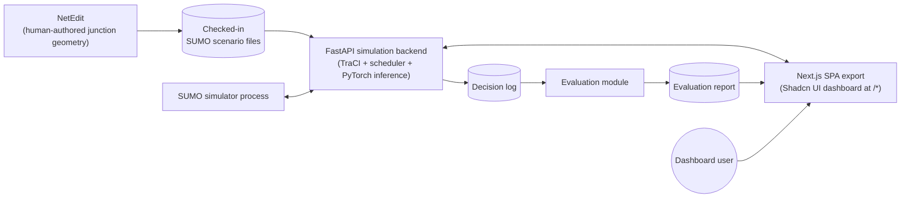
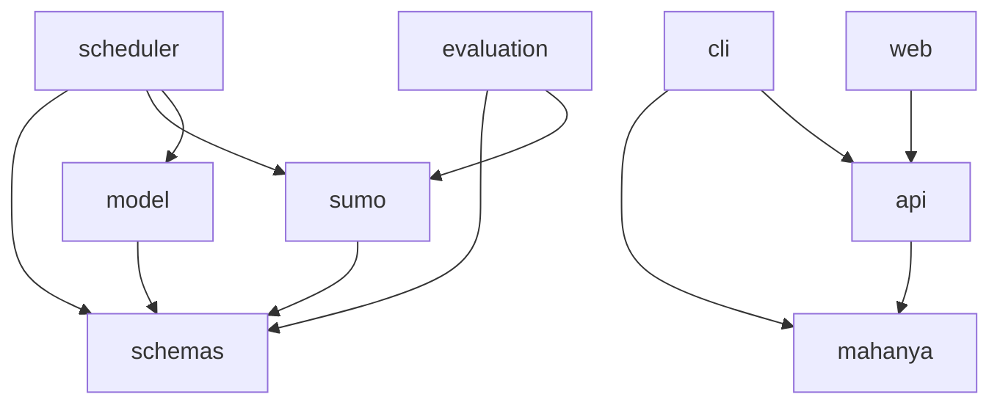

# MaHanya — Architecture

## Scope

This is the technical design reference: justified technology choices, component
boundaries, data contracts, and how the pieces fit together. It is not a
restatement of the [Product Spec](PRODUCT_SPEC.md) or [Product Flow](PRODUCT_FLOW.md)
— read those first for *what* and *why*; this document is *how*.

Nothing under `src/` exists yet. This document specifies a proposed source layout
and component design to build against once implementation starts.

## System context



`NetEdit` is an external GUI tool, not a Python dependency — junction geometry is
authored once, by hand, and the resulting `.net.xml`/`.rou.xml`/`.sumocfg` files
are checked in as data artifacts, not generated by application code.

## Tech stack

| Concern | Choice | Why |
|---|---|---|
| Language | Python 3.11 | Matches SUMO/TraCI's Python bindings and PyTorch; no reason to move off the version already pinned in `.python-version`. |
| Python env / dependency manager | **uv** | Standing project convention for Python toolchains; used for FastAPI, PyTorch, TraCI, data, evaluation, and tests. |
| Web toolchain | Next.js configured for static SPA export, managed with `volta` | Provides a modern TypeScript/React UI while still producing static assets served at `/*`; `package.json` lives at repo root beside `pyproject.toml`, while app source lives in `src/web`. |
| Raw data storage | CSV for field counts; Parquet for generated training sequences | Field counts are small and need to be human-auditable; generated sequences are large and columnar, where Parquet is the efficient, standard choice. |
| Distribution fitting | `scipy.stats` (Poisson, negative binomial) with chi-square/KS goodness-of-fit | Poisson is the standard first choice for independent, low-to-moderate-volume arrivals; negative binomial is the documented fallback when arrivals are over-dispersed. Both are directly supported by `scipy.stats`. |
| Microsimulation | SUMO + TraCI (`traci`, `sumolib`) | Directly mandated by the project synopsis; SUMO is the de facto open-source standard for microscopic traffic simulation with a mature Python control API. |
| Junction geometry authoring | NetEdit | SUMO's own GUI network editor; not a library dependency, a separate authoring tool whose output is checked in as data. |
| Schemas / config | pydantic v2 + `pydantic-settings` | Continues the pattern from the retired `aitrafix` prototype's `types.py`, which already modeled per-direction traffic state cleanly. |
| Model | PyTorch, a small custom `nn.TransformerEncoder` | The synopsis specifically calls for a "lightweight Transformer Encoder" — a small number of layers/heads (roughly 2–4 layers, 2–4 heads, small `d_model`) over an engineered per-timestep feature vector, following the pattern in recent lightweight transformer-based signal-control literature. This explicitly replaces the retired prototype's `RandomForestClassifier` placeholder. |
| Scheduler | Plain deterministic Python (no FSM library) | The rule set (min/max green, transitions, anti-starvation, pre-emption) covers a small, fixed number of states and rules for a single junction. Plain, exhaustively-unit-testable code is more transparent and auditable here than introducing a general FSM library (e.g. `transitions`) for marginal benefit. |
| CLI | Typer | Provides a typed, testable Python CLI for simulation/data/model/API commands with minimal ceremony and good help output. |
| Evaluation | A custom metrics module (waiting time, queue length, throughput, priority response time) | These are standard traffic-engineering metrics with no off-the-shelf library that meaningfully saves effort here; computing them from logged TraCI state is straightforward. |
| API / realtime relay | FastAPI + WebSockets/SSE | The backend owns the SUMO process and TraCI connection, exposes scenario controls, and relays simulation ticks, model recommendations, scheduler decisions, and evaluation metrics through `/api/*` routes. |
| Web | Next.js (SPA static export) + Shadcn UI | Owns the dashboard mounted at `/*`, giving it a componentized React UI, strong TypeScript data contracts, and polished accessible primitives while keeping deployment simple through static export. |
| Testing | `pytest` | Standard; scheduler rules are pure functions and the highest-value unit-test target. |
| Lint / type-check | `ruff`, `mypy --strict` + `pydantic.mypy` plugin | Continues the configuration already present in the retired prototype's `pyproject.toml`. |

### Dependency management

Python dependencies and the virtual environment are managed with **uv**
(`uv sync`, `uv run`, a committed `uv.lock`). The retired prototype used PDM with
a `[[tool.pdm.source]]` entry to pull a CPU-only PyTorch wheel index; the `uv`
equivalent is a `[[tool.uv.index]]` entry (naming the PyTorch CPU wheel index)
combined with a `[tool.uv.sources]` entry pinning `torch` to it. This is a
mechanical migration to make once `pyproject.toml` is reintroduced in the
implementation phase.

The web toolchain is managed from a root-level `package.json` beside the future
root-level `pyproject.toml`. That is possible and preferred: the repo can keep
Python packaging/tooling in `pyproject.toml`, JS/TS scripts/dependencies in
`package.json`, and application source under `src/`. Next.js source lives in
`src/web`, and Next.js must be configured for SPA/static export
(`output: "export"`) so the built dashboard is deployable as static files. Runtime
simulation state does not live in the static bundle; it is requested from the
FastAPI backend under `/api/*` and streamed from FastAPI over WebSockets or
Server-Sent Events under `/api/*`.

### Structure review notes

This layout is intentional, but it has a few implementation constraints:

- The Python side follows the PyPA-recommended `src/` layout so importable
  packages (`mahanya`, `api`, and `cli`) are separate from repository-root
  tooling files and tests.
- The web side keeps `package.json` at repository root beside `pyproject.toml`.
  That is workable with Next.js because root npm scripts can invoke the Next.js
  CLI against a project directory, e.g. `next dev src/web` and `next build
  src/web`. Since `src/web` is the Next.js project directory, its Next-specific
  config files (`next.config.ts`, `tsconfig.json`) stay in `src/web`, and the
  repo root must not also define an `app/`, `pages/`, `src/app/`, or
  `src/pages/` tree that would confuse ownership.
- The FastAPI app should include routers with a single `/api` prefix at the app
  boundary rather than duplicating `/api` in every route module.
- The Typer CLI should be exposed through `pyproject.toml` console-script
  metadata that points to `cli.main:app`, while implementation code remains in
  `src/cli`.

## Component breakdown

The implementation is split under `src/`: `mahanya` owns simulation, model,
scheduler, data, schemas, and evaluation internals; `api` owns FastAPI; `web`
owns the Next.js SPA source; and `cli` owns the Typer CLI (see
[Proposed source layout](#proposed-source-layout)).

- **`schemas`** — shared data contracts (see [Data contracts](#data-contracts)
  below). No other module's dependency; every other module depends on this one.
- **`data`** — ingests raw field-count CSVs, fits statistical distributions,
  and turns SUMO run logs into labelled training sequences (Parquet). Offline,
  batch-oriented.
- **`sumo`** — a thin TraCI client (connect, step, read state, set phase) and a
  translator from raw SUMO state into the `schemas` traffic-state contract.
  Owns all direct TraCI/SUMO interaction so nothing else needs to know TraCI's
  API shape.
- **`model`** — feature engineering, the transformer encoder definition,
  training loop, and inference. Depends only on `schemas`.
- **`scheduler`** — the deterministic rule engine (min/max green, transitions,
  anti-starvation, pre-emption) and the orchestration of one control-loop tick
  (observe → predict → validate → apply → log). Depends only on `schemas`, and
  calls into `sumo` and `model` through their public interfaces rather than
  reaching into their internals.
- **`api`** — the FastAPI application under `src/api`. Owns `/api/*` scenario
  lifecycle endpoints, run/pause/step/reset controls, health/config endpoints,
  and the realtime relay that streams simulation ticks to clients. It does not
  implement traffic-control policy; it calls `mahanya` services and serializes
  their outputs.
- **`evaluation`** — a fixed-time baseline controller plus the metrics module
  (waiting time, queue length, throughput, priority response time), run against
  logged data from both controllers.
- **`web`** — the Next.js static-export SPA under `src/web` using Shadcn UI
  components. It owns the dashboard at `/*`, rendering the live simulation,
  control panels, decision explanations, and evaluation charts by consuming
  FastAPI REST and realtime stream contracts under `/api/*`.
- **`cli`** — the Typer CLI under `src/cli`, exposing the pipeline stages (fit
  distribution, calibrate, generate sequences, train, run, evaluate, serve-api,
  build-web) as subcommands, replacing the retired prototype's ad hoc
  `demo/main.py` train/sim split.

### Module dependency direction



Within `mahanya`, `schemas` is the shared kernel; `sumo`, `model`, and
`evaluation` each depend on it but not on each other. `scheduler` is the only
`mahanya` module allowed to depend on both `sumo` and `model`, since
orchestrating a control-loop tick is its job. The top-level `api` package
depends on `mahanya`, the top-level `cli` package depends on `mahanya` and
`api` command entrypoints, and the `web` app source depends only on the `/api/*`
HTTP/realtime contract, not Python internals.
This deliberately avoids the retired prototype's tight coupling, where
`helpers.py` (the SUMO driver) imported `traffic/__init__.py` (the controller)
directly, making the two impossible to test or evolve independently.

## Data contracts

The retired `aitrafix` prototype had a clean starting shape worth keeping and
extending, not discarding:

```python
# old: src/aitrafix/types.py
class TrafficDirection(Generic[T], BaseModel):
    north: T
    south: T
    east: T
    west: T

class TrafficModel(BaseModel):
    timestamp: str
    vehicles: TrafficDirection[int]
    emergency: TrafficDirection[int]
    light: TrafficDirection[Literal["red", "yellow", "green"]]
```

Proposed evolution for `src/mahanya/schemas/traffic.py`:

- **`TrafficDirection[T]`** — kept as-is; it's a useful generic primitive for any
  per-direction value.
- **`TrafficState`** (extends the old `TrafficModel`) — adds queue length and
  waiting time per direction, current phase, and elapsed phase time, since the
  model needs richer signal than raw counts alone.
- **`PhaseRecommendation`** (new) — the model's output: a recommended phase id
  plus a confidence/logit distribution over phases. Didn't exist in the old
  prototype, which conflated "model output" and "applied state."
- **`SchedulerDecision`** (new) — the final applied phase, whether it matched
  the model's recommendation, and a reason code (`model_accepted`,
  `min_green_hold`, `anti_starvation_force`, `emergency_preempt`, ...). This is
  what makes every override auditable, per the [Product Spec](PRODUCT_SPEC.md#non-functional-requirements)
  requirement.

**Open assumption, flagged for revisit:** the retired prototype enumerated a
fixed 9-state phase space (one direction green, or its yellow, or all-red) for a
simple single-ring 4-leg junction. This is kept as the default assumption for
MaHanya's phase space unless the actual Sapon Under-bridge Junction geometry —
once surveyed — requires protected-turn phases (e.g. simultaneous
non-conflicting greens), which would expand both `PhaseRecommendation`'s output
space and the SUMO network's phase definitions. This should be confirmed once
the real junction layout is available, not assumed permanently.

## Config strategy

A single `pydantic-settings`-based `Config` object, layered: in-code defaults →
an optional `config.yaml`/`.env` → CLI overrides. One config surface covers
simulation parameters (SUMO scenario paths, control interval), model
hyperparameters (sequence length, model dimensions), scheduler thresholds
(minimum/maximum green seconds, anti-starvation threshold, transition interval
lengths), and dashboard refresh interval — avoiding the retired prototype's
pattern of scattering magic numbers (e.g. hardcoded phase maps, a hardcoded
traffic-light id) across multiple classes.

## Testing strategy

- **Unit tests** for `scheduler` rules — pure functions, no I/O, the highest
  priority target since this is the safety-critical layer. Should exhaustively
  cover minimum/maximum green edge cases, transition sequencing, anti-starvation
  triggering, and pre-emption interrupting/resuming normal control.
- **Contract/shape tests** for `model` — verify input/output shapes and that
  inference never raises on well-formed input; explicitly not accuracy
  assertions (accuracy is an evaluation concern, not a unit-test concern).
- **One headless integration test** running a short scenario via `sumo` (not
  `sumo-gui`) end-to-end through the control loop, to catch integration
  regressions between `sumo`, `scheduler`, and `schemas`.
- Fixtures for synthetic `TrafficState` sequences live under `tests/fixtures/`,
  so scheduler and model tests don't depend on a running SUMO instance.

## Observability / logging

Every control-loop tick appends one JSON-lines record to the decision log:
observed `TrafficState`, the model's `PhaseRecommendation` (if the tick wasn't a
pre-emption short-circuit), the resulting `SchedulerDecision` with its reason
code, and a timestamp. This is a per-line evolution of the retired prototype's
pattern of dumping one big JSON blob of `state_history` at the end of a run —
per-line records are what let the dashboard poll incrementally instead of
waiting for a run to finish.

<a id="dashboard"></a>

## API and dashboard

FastAPI is the process boundary between simulation/control and presentation. It
starts or attaches to SUMO through the `sumo` module, advances the scheduler's
control loop, persists per-tick decision records, and relays each tick to the
web app. All FastAPI routes are mounted under `/api/*`; the preferred live
channel is WebSockets when bidirectional control is needed. Server-Sent Events
are acceptable for read-only telemetry streams. REST endpoints under `/api/*`
cover scenario discovery, run/pause/step/reset commands, current state
snapshots, historical decision-log queries, and evaluation-report access.

The dashboard is a Next.js app in `src/web` using Shadcn UI and configured for
SPA/static export. It owns `/*`, while FastAPI owns `/api/*`. The exported
assets are intentionally dumb/static: they do not embed a simulation engine and
do not talk directly to TraCI. All simulation state flows through FastAPI, which
keeps the SUMO process, PyTorch model, and scheduler on
the Python side where their dependencies are native. See [Product Flow](PRODUCT_FLOW.md#dashboard-data-source)
for the operational view of this.

## Execution model

This is simulation-only — there is no "deployment" in a production sense, only
"how to run a scenario locally." A single scenario run involves: the SUMO
process (started via TraCI), the FastAPI backend in `src/api` (serving
`/api/*` and relaying state), and the Next.js SPA in `src/web` (serving `/*`
and rendering the dashboard from FastAPI data). For development, run FastAPI through the Typer CLI and run the Next.js dev
server through root `package.json` scripts. For a simple local demo, build the
Next.js SPA export and serve it as static files at `/*` while proxying or
mounting FastAPI only at `/api/*`.

## Proposed source layout

Not created yet — documented here as the target for the implementation phase.

```
pyproject.toml                      # Python metadata, uv config, [project.scripts] -> cli.main:app
package.json                        # root JS/TS scripts, e.g. next dev src/web / next build src/web
src/
├── mahanya/
│   ├── __init__.py
│   ├── config.py                  # pydantic-settings Config: paths, sim params, hyperparams, thresholds
│   ├── schemas/
│   │   ├── __init__.py
│   │   └── traffic.py              # TrafficDirection[T], TrafficState, PhaseRecommendation, SchedulerDecision
│   ├── data/
│   │   ├── ingest.py                # load raw field-count CSVs
│   │   ├── distribution_fit.py      # scipy.stats fitting (Poisson/NB) + goodness-of-fit
│   │   └── sequence_gen.py          # SUMO run logs -> labelled training sequences (Parquet)
│   ├── sumo/
│   │   ├── network/                 # NetEdit-authored .net.xml/.rou.xml/.sumocfg (data, not code)
│   │   ├── traci_client.py          # thin TraCI wrapper: connect/step/get-state/set-phase
│   │   └── state_extractor.py       # SUMO state -> TrafficState
│   ├── model/
│   │   ├── features.py              # per-timestep feature engineering
│   │   ├── transformer.py           # lightweight nn.TransformerEncoder definition
│   │   ├── train.py                 # training loop, checkpointing
│   │   └── infer.py                 # load model, produce PhaseRecommendation
│   ├── scheduler/
│   │   ├── rules.py                 # min/max green, transitions, anti-starvation, pre-emption
│   │   └── controller.py            # one control-loop tick: observe -> predict -> validate -> apply -> log
│   └── evaluation/
│       ├── baseline.py              # fixed-time baseline controller
│       └── metrics.py               # waiting time, queue length, throughput, priority response time
├── api/
│   ├── __init__.py
│   ├── app.py                       # FastAPI app factory; mounts all routes under /api/*
│   ├── routes.py                    # /api/* REST endpoints: scenarios, controls, snapshots, reports
│   └── streams.py                   # /api/* WebSocket/SSE simulation relay
├── web/
│   ├── app/                         # Next.js SPA routes mounted at /*
│   ├── components/                  # Shadcn-based UI components
│   ├── lib/                         # API client, stream client, generated/shared types
│   ├── next.config.ts               # output: "export"; Next project config for src/web
│   └── tsconfig.json
└── cli/
    ├── __init__.py
    └── main.py                      # Typer app: fit, calibrate, generate, train, run, evaluate, serve-api, build-web
tests/
├── unit/
├── integration/
└── fixtures/
data/                              # gitignored: raw + processed datasets
models/                            # gitignored: trained model artifacts
```

## Migration notes from aitrafix

**Kept (as inspiration, not verbatim code — the old code is deleted):**
- The `TrafficDirection[T]` / `TrafficModel` pydantic shape, extended into
  `TrafficState`.
- The general pattern of a thin TraCI wrapper translating SUMO state into a
  typed schema.
- Per-tick JSON logging, evolved from one big end-of-run blob into
  per-line JSON-lines records.

**Discarded:**
- The `RandomForestClassifier` placeholder — the synopsis calls for a
  transformer encoder, not a random forest.
- The duplicated `TrafficController` / `VehicleCounter` classes (near-identical
  code with no clear reason for the split).
- The fixed 9-state enumeration treated as the *only possible* phase space
  (kept as a documented default assumption instead, see
  [Data contracts](#data-contracts)).
- The `"manual"` `input()`-driven control mode in `SUMOTrafficSimulation.run` —
  useful for early prototyping, not part of the evaluated system.
- PDM as the dependency manager, in favor of `uv` for Python and `volta` for the `src/web` web workspace.

## Not scaffolded in this phase

No CI workflow is created yet — not requested for this documentation phase, and
naturally belongs with the implementation phase once there are Python and
web tests for it to run.

## References

The literature cited in the underlying project synopsis, tied to the specific
design decisions above they ground:

- Vaswani, A., Shazeer, N., Parmar, N., Uszkoreit, J., Jones, L., Gomez, A. N.,
  Kaiser, L., & Polosukhin, I. (2017). Attention is all you need. *Advances in
  Neural Information Processing Systems*, 30, 5998–6008. — The foundational
  Transformer architecture; underlies choosing a `nn.TransformerEncoder` (see
  [Tech stack](#tech-stack): Model) over the retired prototype's RandomForest
  placeholder.
- Zhao, R., Hu, H., Li, Y., Fan, Y., Gao, F., & Gao, Z. (2024). Sequence
  decision transformer for adaptive traffic signal control. *Sensors*,
  24(19), 6202. — The synopsis's own precedent for treating a window of
  traffic-state sequences as input to a transformer-based phase recommender;
  directly motivates the `model` component's design (see
  [Component breakdown](#component-breakdown) and [Data contracts](#data-contracts)).
- Lopez, P. A., Behrisch, M., Bieker-Walz, L., Erdmann, J., Flötteröd, Y. P.,
  Hilbrich, R., Lücken, L., Rummel, J., Wagner, P., & Wießner, E. (2018).
  Microscopic traffic simulation using SUMO. In *2018 21st International
  Conference on Intelligent Transportation Systems (ITSC)* (pp. 2575–2582).
  IEEE. — The reference paper for SUMO itself; justifies SUMO + TraCI as the
  microsimulation choice (see [Tech stack](#tech-stack): Microsimulation) over
  building or adopting a different simulator.
- Abdulhai, B., Pringle, R., & Karakoulas, G. J. (2003). Reinforcement
  learning for true adaptive traffic signal control. *Journal of
  Transportation Engineering*, 129(3), 278–285. — An early precedent for
  learned (rather than fixed-time) signal control validated in simulation;
  supports the overall approach of pairing a learned recommender with a
  deterministic safety layer rather than trusting a learned controller's
  output directly (see [Scope](#scope) and the `scheduler` component in
  [Component breakdown](#component-breakdown)).
- Python Packaging Authority. [*src layout vs flat layout*](https://packaging.python.org/en/latest/discussions/src-layout-vs-flat-layout/). — Supports keeping
  importable Python packages under `src/`, separate from repository-root tooling
  files and tests (see [Dependency management](#dependency-management) and
  [Proposed source layout](#proposed-source-layout)).
- Python Packaging Authority. [*Creating and packaging command-line tools*](https://packaging.python.org/en/latest/guides/creating-command-line-tools/). —
  Supports exposing the Typer application through `pyproject.toml` console
  scripts while keeping implementation under `src/cli` (see [Tech stack](#tech-stack): CLI).
- Next.js documentation. [*File-system conventions: src Directory*](https://nextjs.org/docs/pages/api-reference/file-conventions/src-folder) and [*next CLI*](https://nextjs.org/docs/pages/api-reference/cli/next).
  — Grounds the choice to keep web source/config under `src/web` and have
  root-level package scripts call the Next CLI with `src/web` as the project
  directory (see [Structure review notes](#structure-review-notes)).
- Next.js documentation. [*Static Exports*](https://nextjs.org/docs/app/guides/static-exports). — Grounds `output: "export"` for a
  static dashboard served at `/*` (see [API and dashboard](#api-and-dashboard)).
- FastAPI documentation. [*Bigger Applications - Multiple Files*](https://fastapi.tiangolo.com/tutorial/bigger-applications/). — Grounds using
  routers and a single `/api` prefix at the application boundary (see
  [API and dashboard](#api-and-dashboard)).
- Typer documentation. [*Building a Package*](https://typer.tiangolo.com/tutorial/package/). — Grounds keeping a packaged Typer
  app in `src/cli` and exposing it as the project CLI (see [Component breakdown](#component-breakdown)).
