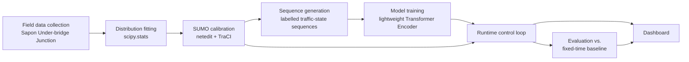
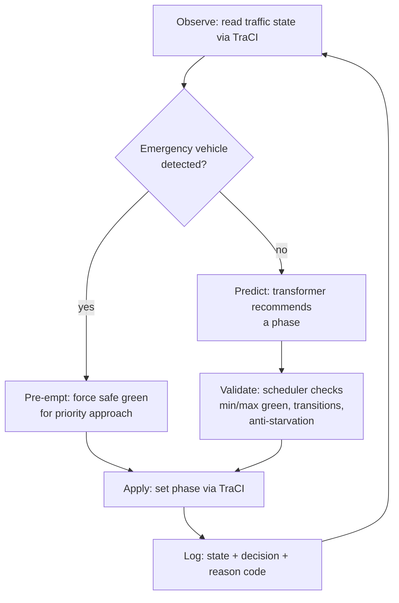

# MaHanya — Product Flow

This document describes the end-to-end flow of data and control through MaHanya —
from a field traffic count to a dashboard on someone's screen. For *what* the
system must do, see [Product Spec](PRODUCT_SPEC.md). For *how* it's built, see
[Architecture](ARCHITECTURE.md).

## Pipeline overview

## Stage-by-stage

### 1. Field data collection
- **Input:** manual/observed vehicle counts at the Sapon Under-bridge Junction,
  per direction, across peak and off-peak sessions.
- **Output:** raw count records (timestamped, per direction, per period).
- **Tooling:** manual data entry / CSV.
- **Owner:** offline, one-time (per calibration cycle) field work — not a
  runtime component.

### 2. Distribution fitting
- **Input:** raw count records from stage 1.
- **Output:** fitted distribution family + parameters (e.g. Poisson λ per
  direction/period, or negative binomial parameters if arrivals are
  over-dispersed) plus goodness-of-fit results.
- **Tooling:** `scipy.stats`.
- **Owner:** offline batch step.

### 3. SUMO calibration
- **Input:** fitted distribution parameters; junction geometry authored in
  `netedit`.
- **Output:** a calibrated multi-phase SUMO scenario (`.net.xml`, `.rou.xml`,
  `.sumocfg`) whose vehicle-insertion process matches the fitted real-world
  arrival pattern.
- **Tooling:** `netedit` (network geometry, human-authored, checked in as data)
  + a route-generation step driven by the fitted parameters.
- **Owner:** offline batch step, re-run whenever calibration data changes.

### 4. Sequence generation
- **Input:** the calibrated SUMO scenario.
- **Output:** labelled time-series traffic-state sequences (per-direction
  counts, queue length, waiting time, emergency flags, signal phase, elapsed
  phase time) suitable for supervised training.
- **Tooling:** TraCI-driven simulation runs, logged to Parquet.
- **Owner:** offline batch step.

### 5. Model training
- **Input:** labelled sequences from stage 4.
- **Output:** a trained lightweight Transformer Encoder that maps a window of
  traffic state to a recommended signal phase.
- **Tooling:** PyTorch.
- **Owner:** offline batch step; produces a versioned model artifact.

### 6. Runtime control loop
The live loop that actually drives a simulated junction. See the detailed
diagram below. Consumes the calibrated SUMO scenario (stage 3) and the trained
model (stage 5); produces a live decision log.

### 7. Evaluation vs. fixed-time baseline
- **Input:** the same calibrated scenarios, run once under the runtime control
  loop and once under a fixed-time baseline controller.
- **Output:** comparative metrics — average waiting time, queue length,
  throughput, priority-vehicle response time.
- **Tooling:** a metrics module operating on logged run data.
- **Owner:** offline batch step, re-run per evaluation cycle.

### 8. Dashboard
- **Input:** the live decision log from stage 6, and evaluation reports from
  stage 7.
- **Output:** a real-time-ish view of junction state, active phase, priority
  events, and the model's recommendation vs. the scheduler's actual decision;
  plus evaluation results.
- **Tooling:** Streamlit, polling the logged state store (see
  [Architecture](ARCHITECTURE.md#dashboard) for why it polls rather than
  attaches in-process).

## Runtime control loop (detail)

Emergency pre-emption is a short-circuit: it bypasses the model entirely and
goes straight to a rule-determined safe state. In all other ticks, the model's
recommendation is advisory — the scheduler is free to hold, delay, or override
it, and every such decision is logged with a reason code (e.g.
`emergency_preempt`, `min_green_hold`, `anti_starvation_force`,
`model_accepted`).

## Data lineage

| Artifact | Produced by | Consumed by |
|---|---|---|
| Raw count records (CSV) | Field data collection | Distribution fitting |
| Fitted distribution parameters | Distribution fitting | SUMO calibration |
| Calibrated scenario (`.net.xml`/`.rou.xml`/`.sumocfg`) | SUMO calibration (+ `netedit`) | Sequence generation, runtime control loop, evaluation |
| Labelled sequences (Parquet) | Sequence generation | Model training |
| Trained model weights | Model training | Runtime control loop |
| Runtime decision log (JSON-lines) | Runtime control loop | Evaluation, dashboard |
| Evaluation report | Evaluation | Dashboard |

## Failure and fallback behavior

The runtime control loop is safety-critical, so failure modes are handled
explicitly rather than left to crash:

- **TraCI disconnects mid-run.** The control loop must fail loudly at the
  process boundary (log and stop), not silently continue on stale state.
- **Model inference fails or times out.** The scheduler must fall back to a
  safe default phase (e.g. hold current phase until minimum/maximum green
  rules force a change) rather than blocking on or propagating the failure —
  the deterministic layer never depends on the model succeeding.
- **Emergency detected while a phase is mid-transition.** Pre-emption still
  takes effect at the next legal transition point; it does not skip a
  yellow/all-red clearance interval, since that would itself be unsafe.

## Dashboard data source

The dashboard reads the runtime decision log (a logged state store — JSON-lines
or SQLite) rather than attaching to the control loop in-process. This is a
direct consequence of Streamlit's execution model: a Streamlit app reruns
top-to-bottom on each interaction/refresh, which doesn't suit holding a live
reference into another process's loop state. The control loop writes a record
per tick; the dashboard polls and renders the latest records.
